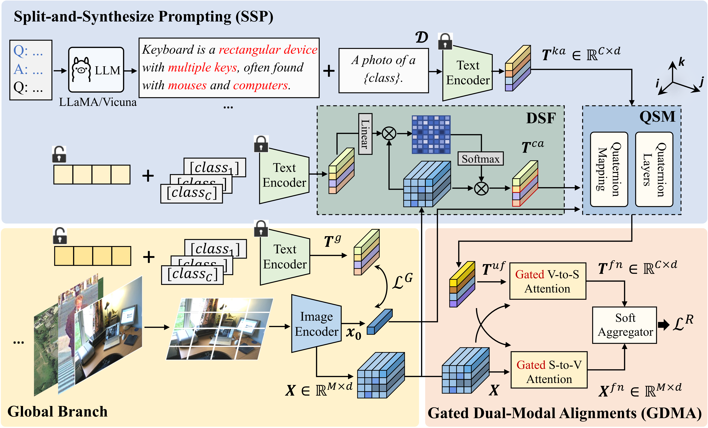

# SSPA: Split-and-Synthesize Prompting with Gated Alignments for Multi-Label Image Recognition

    

Multi-label image recognition is a fundamental task in computer vision. Recently, Vision-Language Models (VLMs) have made notable advancements in this area. However, previous methods fail to effectively leverage the rich knowledge in language models and often incorporate label semantics into visual features unidirectionally. To overcome these problems, we propose a Split-and-Synthesize Prompting with Gated Alignments (SSPA) framework to amplify the potential of VLMs. Specifically, we develop an in-context learning approach to associate the inherent knowledge from LLMs. Then we propose a novel Split-and-Synthesize Prompting (SSP) strategy to first model the generic knowledge and downstream label semantics individually and then aggregate them carefully through the quaternion network. Moreover, we present Gated Dual-Modal Alignments (GDMA) to bidirectionally interact visual and linguistic modalities while eliminating redundant cross-modal information, enabling more efficient region-level alignments. Rather than making the final prediction by a sharp manner in previous works, we propose a soft aggregator to jointly consider results from all image regions. With the help of flexible prompting and gated alignments, SSPA is generalizable to specific domains. Extensive experiments on nine datasets from three domains (i.e., natural, pedestrian attributes and remote sensing) demonstrate the state-of-the-art performance of SSPA. Further analyses verify the effectiveness of SSP and the interpretability of GDMA.

